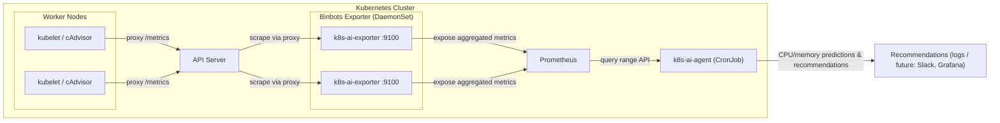

# Binbots-k8s: Kubernetes Scraper + AI Agent

Go exporter scrapes kubelet/cAdvisor via **API server proxy** (safe on EKS, AKS, GKE and local). Python AI agent pulls metrics from Prometheus and prints CPU/memory trend recommendations. Designed to work with **kube-prometheus-stack** on local and managed clouds.

## How it works



**Flow summary**

| Step | Component | Action |
|------|-----------|--------|
| 1 | **k8s-ai-exporter** (Go, DaemonSet) | Scrapes kubelet/cAdvisor via API server proxy per node; filters out Succeeded/Failed pods; aggregates CPU/memory per node. |
| 2 | **k8s-ai-exporter** | Exposes Prometheus metrics on `:9100/metrics` (`k8s_node_cpu_usage_cores`, `k8s_node_memory_usage_bytes`, `k8s_node_active_pods`). |
| 3 | **Prometheus** (kube-prometheus-stack) | Scrapes each exporter pod (ServiceMonitor); stores time series. |
| 4 | **k8s-ai-agent** (Python, CronJob) | Pulls metrics from Prometheus, runs trend prediction (Prophet or simple stats), prints optimization suggestions. |

## Layout

```
.
├── go/                    # Go exporter (DaemonSet)
│   ├── go.mod
│   ├── main.go
│   └── Dockerfile
├── python/                # AI agent (CronJob)
│   ├── requirements.txt
│   ├── ai_agent.py
│   └── Dockerfile
├── deploy/                # Kubernetes manifests (separate YAMLs)
│   ├── namespace.yaml
│   ├── serviceaccount.yaml
│   ├── clusterrole.yaml
│   ├── clusterrolebinding.yaml
│   ├── daemonset-exporter.yaml
│   ├── service-exporter.yaml
│   ├── servicemonitor-exporter.yaml
│   └── cronjob-ai-agent.yaml
└── README.md
```

## Prerequisites

- Kubernetes cluster (local: kind/minikube/k3d, or EKS/AKS/GKE)
- **kube-prometheus-stack** installed (Prometheus Operator) in `monitoring` (or same namespace as below)
- `kubectl` and cluster access

## 1. Install kube-prometheus-stack (if not already)

```bash
helm repo add prometheus-community https://prometheus-community.github.io/helm-charts
helm repo update
helm install prometheus-stack prometheus-community/kube-prometheus-stack -n monitoring --create-namespace
```

If your release name is different, set the same label on the ServiceMonitor (see below).

## 2. Build and push images

Replace `your-registry` with your container registry (e.g. Docker Hub, ECR, GCR, ACR).

```bash
# Go exporter
docker build -t your-registry/k8s-ai-exporter:latest ./go
docker push your-registry/k8s-ai-exporter:latest

# Python AI agent
docker build -t your-registry/k8s-ai-agent:latest ./python
docker push your-registry/k8s-ai-agent:latest
```

## 3. Update image references in deploy/

Edit:

- `deploy/daemonset-exporter.yaml`: set `image: your-registry/k8s-ai-exporter:latest`
- `deploy/cronjob-ai-agent.yaml`: set `image: your-registry/k8s-ai-agent:latest`

## 4. Deploy (order matters)

Apply in this order (all YAMLs in `deploy/` are separate files):

```bash
kubectl apply -f deploy/namespace.yaml
kubectl apply -f deploy/serviceaccount.yaml
kubectl apply -f deploy/clusterrole.yaml
kubectl apply -f deploy/clusterrolebinding.yaml
kubectl apply -f deploy/daemonset-exporter.yaml
kubectl apply -f deploy/service-exporter.yaml
kubectl apply -f deploy/servicemonitor-exporter.yaml
kubectl apply -f deploy/cronjob-ai-agent.yaml
```

Or apply the whole directory (order is deterministic by filename):

```bash
kubectl apply -f deploy/
```

## 5. ServiceMonitor label (kube-prometheus-stack)

The ServiceMonitor uses:

```yaml
labels:
  release: prometheus-stack
```

This must match the **Helm release name** of your kube-prometheus-stack. If you installed with a different name (e.g. `kube-prometheus-stack`), edit `deploy/servicemonitor-exporter.yaml` and set:

```yaml
labels:
  release: <your-helm-release-name>
```

Alternatively, configure Prometheus to select all ServiceMonitors (e.g. `serviceMonitorSelector: {}` in the Helm values).

## 6. Prometheus URL for the AI agent

The CronJob uses:

`PROMETHEUS_URL=http://prometheus-kube-prometheus-prometheus.monitoring.svc:9090`

That matches the default service name from **kube-prometheus-stack**. If your Prometheus service has a different name, set the `PROMETHEUS_URL` env in `deploy/cronjob-ai-agent.yaml`.

## 7. Verify

- Exporter (one pod per node):

  ```bash
  kubectl get pods -n monitoring -l app=k8s-ai-exporter
  kubectl port-forward -n monitoring svc/k8s-ai-exporter 9100:9100
  curl http://localhost:9100/metrics
  ```

- Prometheus should scrape the exporter (targets UI or `k8s_node_cpu_usage_cores`).
- AI agent runs every 10 minutes; to run once:

  ```bash
  kubectl create job -n monitoring ai-agent-manual --from=cronjob/k8s-ai-agent
  kubectl logs -n monitoring job/ai-agent-manual -f
  ```

## Environments

- **Local (kind, minikube, k3d, k3s)**: Same manifests; ensure kube-prometheus-stack and this stack share the same namespace or adjust `namespaceSelector` / Prometheus URL.
- **EKS / AKS / GKE**: Exporter uses API server proxy only (no direct kubelet node port); no `hostNetwork` or privileged pods. Same YAMLs and ServiceMonitor.

## Optional

- **Grafana**: Add a dashboard for `k8s_node_cpu_usage_cores`, `k8s_node_memory_usage_bytes`, `k8s_node_active_pods`.
- **Slack / webhook**: Extend `ai_agent.py` to POST recommendations to a webhook.
- **Different schedule**: Change `schedule` in `deploy/cronjob-ai-agent.yaml` (e.g. `"*/5 * * * *"` for every 5 minutes).
